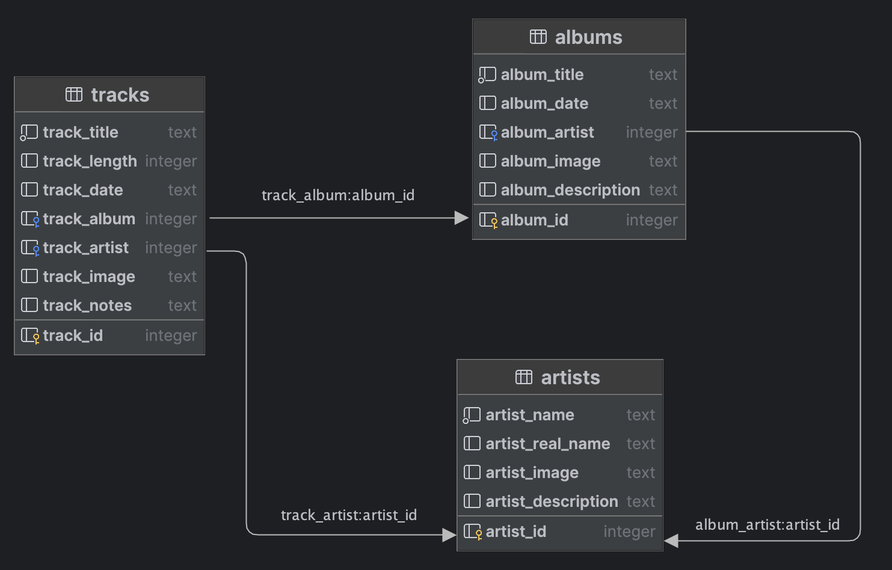

# Ethel Cain Song Tracker Database and Backend setup
- The backend is written in [Go](https://go.dev/) and the database is an [SQLite](https://www.sqlite.org) database

## Setup Database
- The database is currently housed in the repo, as it is easier to manage. These steps assume you need to create the database locally.
    - Ensure that you have SQLite installed on your system.
    - Create a database named `EthelCain.db` in the `../backend/database` directory
    - Run in order the SQL commands found in the `db-tables.sql` file to create the tables
    - Run in order the SQL commands found in the `insert-data.sql` file to fill the tables with data
        - This file should be updated with any new data, if it is to remain the source of truth for the database.
- The database structure currently looks like this:
    

## Setup and Start Backend
- [Download and install Go](https://go.dev/doc/install)
- Start Backend:
    - Navigate to `main` directory `../backend/main`
    - Run `go run .`

